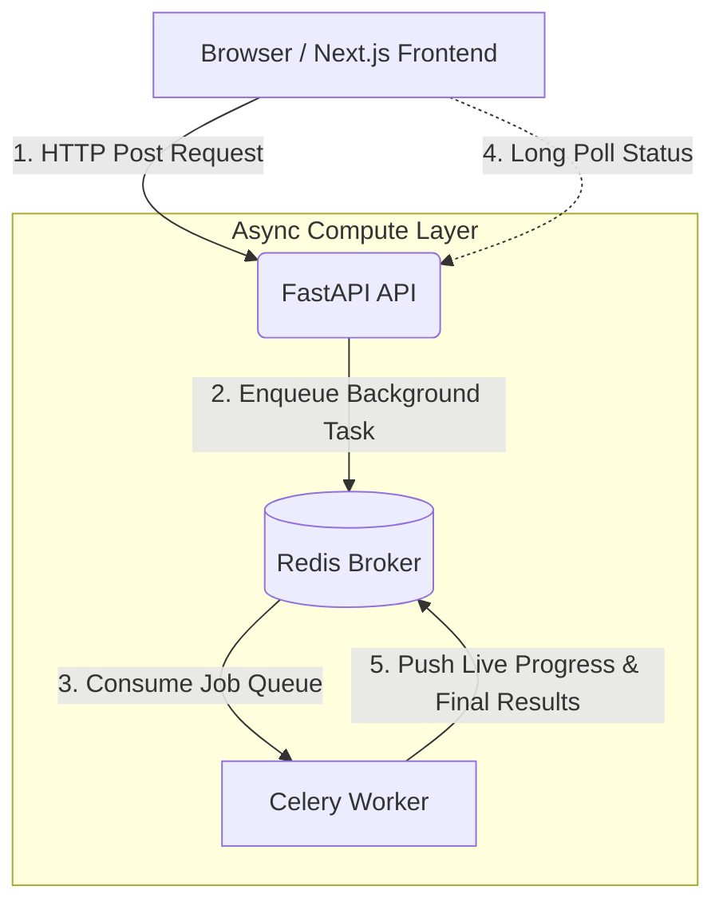

# Nifty & Bank Nifty Options Backtester

A full-stack web application for backtesting **Options strategies** on Nifty and Bank Nifty indices — wrapping a production-grade quant engine in an asynchronous API and a premium, interactive dashboard.

<p align="center">
  
  
  
  
  
  
</p>

---

## Features

- **Built-In Strategies**
  - **Wall Reversion:** Detects implied-volatility anomalies across the option chain and trades reversions.
  - **Opening Range Breakout (ORB):** Detects breakout entries compared to the opening range (max and min values of the underlying within a defined timeframe).
  - **Short Straddle:** Sells ATM Call + Put, featuring a breakeven shift Stop Loss (SL).
  - *Note:* Run strategies independently or **combined** across Nifty and Bank Nifty data, with customizable parameters (capital, IV thresholds, anomaly requirements, exit rules, and session timings).
- **Asynchronous Backtesting:** Runs are queued to a Celery worker, keeping the UI highly responsive with live **"processing day N of M"** progress tracking.
- **Interactive Charts Explorer (D3.js):** Seamlessly switch between **Equity Curve**, **Max Drawdown**, and **Spot Price Candlestick** views on a synchronized daily axis. Includes rich tooltips, crosshairs, and peak-drawdown markers.
- **Comprehensive Tear Sheet:** Tracks 6 headline metrics (Total PnL, Max DD, Sharpe, Win Rate, Profit Factor, Initial Capital) alongside a paginated trade log featuring CE/PE and win/loss cues.
- **Premium Dark UI:** Frosted-glass "terminal" aesthetic with realistic depth and light diffusion.
- **Robust Error Handling:** Readable validation errors, missing-dataset alerts, and empty-result states surfaced cleanly in the UI.

---

## Tech Stack

| Layer          | Technology                                                           |
|----------------|----------------------------------------------------------------------|
| **Frontend** | Next.js 16 (App Router), React 19, Tailwind v4, shadcn/ui, **D3.js** |
| **Backend** | FastAPI, Pydantic                                                    |
| **Async Tasks**| Celery + Redis                                                       |
| **Quant / Data**| Pandas, NumPy, SciPy, PyArrow (Parquet)                             |
| **Tooling** | Docker, Docker Compose                                               |

---

## Architecture


> *The browser communicates exclusively with the Next.js server, which proxies `/api/*` to FastAPI. A single origin serves the entire application, eliminating CORS overhead.*

---

## Quick Start

### Prerequisites
- **Python** 3.12+ 
- **Node.js** 20+
- **Redis** 5+

### 1. Clone the Repository
```bash
git clone https://github.com/Moksh-Sanghavi/Options-backtester.git
cd Options-backtester
```

### 2. Install Dependencies

**Backend (Python):**
```bash
cd backend
python -m venv .venv
# Windows:  .venv\Scripts\activate      |   macOS/Linux:  source .venv/bin/activate
pip install -r requirements.txt
cd ..
```

**Frontend (Node.js):**
```bash
cd frontend
npm install
cd ..
```

### 3. Run the Application

**One-Command Launch (Recommended):**

| OS | Command |
|----|---------|
| **Windows** | `powershell -ExecutionPolicy Bypass -File start-all.ps1` (or execute desktop shortcut) |
| **macOS** | `./start-mac.command` (First time: `chmod +x start-mac.command stop-mac.command`) |

*This script boots Redis, the API, the Celery worker, and the frontend, automatically opening the app. Teardown with `stop-all.ps1` or `./stop-mac.command`.*

**Docker (Alternative):**
```bash
docker compose up --build
```
*Requires Docker Desktop. Initializes Redis, API, worker, and frontend simultaneously.*

---

## Project Structure

```text
backend/
  app/
    engine/        # Quant engine: strategy, execution, analytics, data, IV, costs
    main.py        # FastAPI routing
    tasks.py       # Celery tasks wrapping backtest runs
    celery_app.py  # Celery & Redis configuration
    schemas.py     # API request/response models
  scripts/
    convert_to_parquet.py   # CSV → Parquet utility
  data/            # Nifty and Bank Nifty Parquet datasets 
frontend/
  src/
    components/    # Dashboards, config panels, D3 charts, tear sheets, trade logs
    hooks/         # Backtest run/poll state machines
    lib/           # Typed API clients, formatters, chart data
```

---

## Extending the Engine

Detailed instructions for integrating new underlying datasets or strategies can be found in the **[Extending the Backtester Guide](extending_the_backtester_guide.md)**.

- **New Data:** Drop-in ready. Run the converter script with a new `--dataset` flag, and it will automatically populate in the UI, allowing you to easily scale beyond Nifty and Bank Nifty.
- **New Strategies:** Highly modular. The results pipeline (charts, metrics, trade logs) is strategy-agnostic and functions automatically once your custom strategy emits trade events.

---

## Technical Notes

- Transaction costs (brokerage, STT, exchange fees, GST, stamp duty) are modeled strictly per current **NSE/NFO rates** in `backend/app/engine/constants.py`.
- Backtest runtime scales linearly with the number of trading days. Note that the Celery worker runs single-threaded (`--pool=solo`) to maintain compatibility across OS environments.
- The repository includes sample data for demonstration purposes. Swap in your proprietary historical Nifty or Bank Nifty data via the included converter.

---

### Disclaimer
*This software is for educational and research purposes only. Do not use this engine to make live financial decisions without independent verification. The developers assume no liability for financial losses incurred.*

<p align="center"><sub>Built with FastAPI · Celery · Next.js · D3.js</sub></p>
